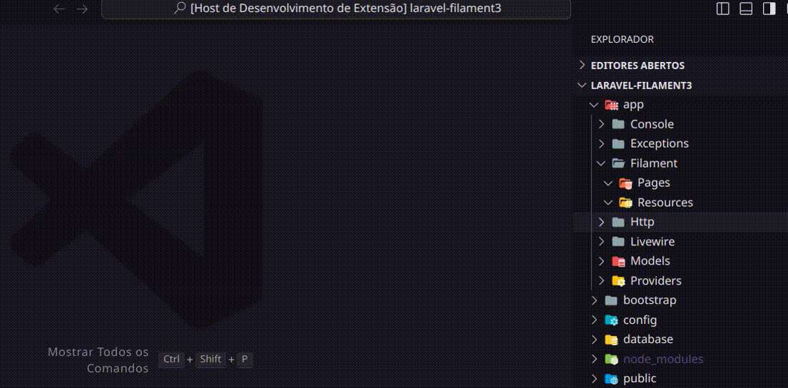

# Filament Helpers (vs code)

This plugin helps to Run filamentephp commands within Visual Studio Code

## Features

- Creating a Widget.
- Creating a Custom Page.
- Creating a Relation Manager.
- Creating a Resource.
- Creating a Panel.
- Creating a Theme.

## Demo

## Usage

### Command Pallet

Once you have installed the extension, You can then open the command pallet (Ctrl + Shift + P or Cmd + Shift + P) and
just type `filament` to get a list of commands.

## Known Issues

Chart widget creation does not work

## Release Notes

### 0.2.0

- Run with sail if exist

### 0.1.0

- Initial release
